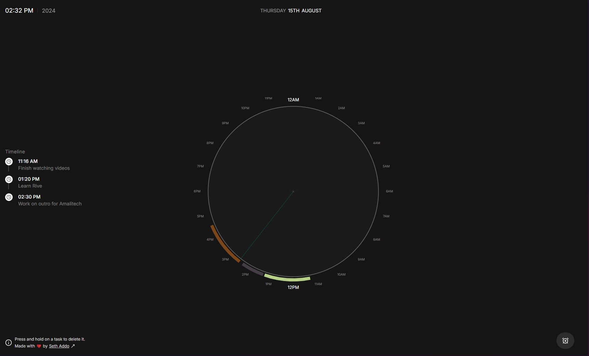

# Task Clock

<div align="center">
  
</div>

<br />
<br />

<p align="center">
  <span style="font-size: 1.35rem; font-style: italic">Track your tasks with a 24hr clock</span>
</p>

######

### Built to work seamlessly with these technologies:

<p>
  <a href="https://skillicons.dev">
    
  </a>
</p>

## ⌨️ Development

Clone locally:

```bash
git clone https://github.com/seths10/task-clock.git
```

```bash
cd task-clock
```

```bash
npm install
```

Open your browser and visit <http://localhost:3000>
